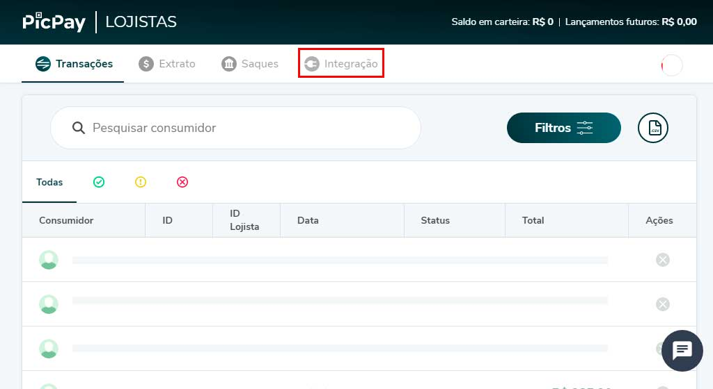
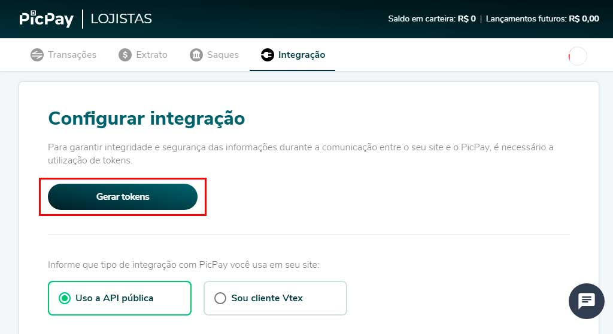
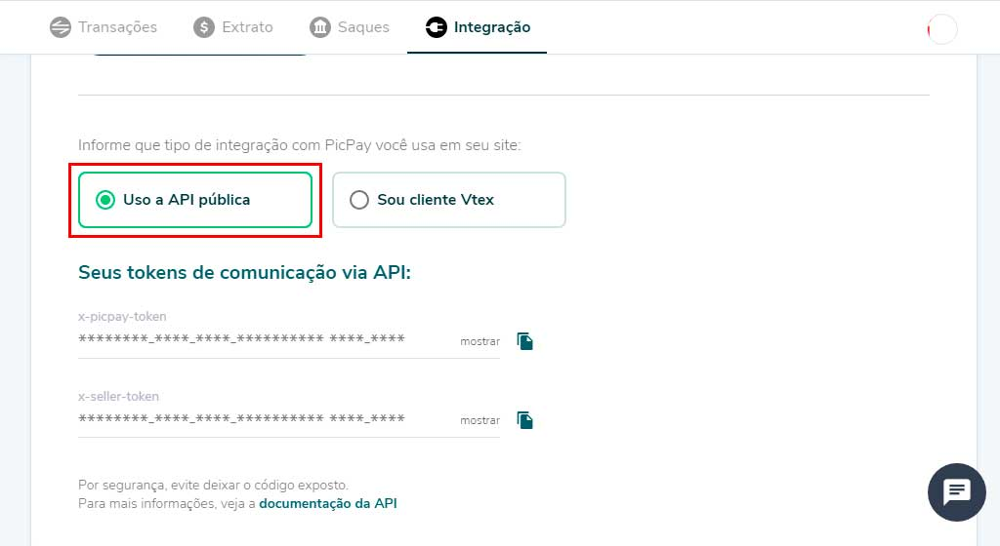
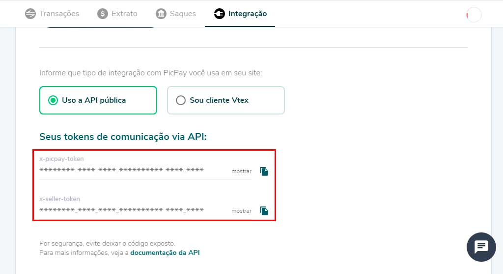

# Obtendo credenciais

Obtenha as credenciais de acesso para a integração entre o WooCommerce e PicPay.

## Acesso a conta

Isso se aplica caso você ainda não possua as credenciais de API do PicPay. Você precisa de uma conta do [PicPay e-commerce](https://ecommerce.picpay.com/) para continuar.

## Procedimentos

1. Entre na sua conta do PicPay e-commerce em: [https://lojista.picpay.com/dashboard](https://lojista.picpay.com/dashboard).
2. Localize e clique no menu "Integração" e aguarde a nova tela aberta.

3. Na nova tela, click no botão em destaque "Gerar Tokens". 

4. Certifique-se que a opção tipo de integração "Uso a API pública", esteja marcada. 

5. Copie e guarde as informações dos campos **x-picpay-token** e **x-seller-token**.

6. Use as credenciais para [configurar](README?id=configuração) as opões do plugin.